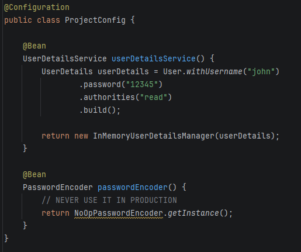
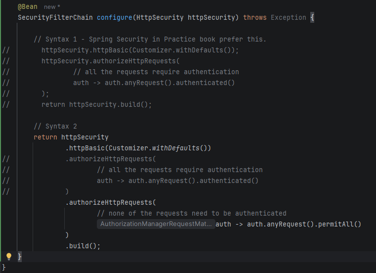

# Overriding Default Configurations

Bu bölümde Spring Security Basic Authentication'un default konfigurasyonlarını override edeceğiz.
İlk `README.md`'de bahsettiğimiz `DaoAuthenticationProvider`'ın kullandığı `UserDetailsService`, `PasswordEncoder` ve Basic Authentication'u ele alacağız.

## DaoAuthenticationProvider

> **DaoAuthenticationProvider**, Spring Security'nin varsayılan authentication provider implementasyonu:
> - `UsernamePasswordAuthenticationToken` alır
> - `UserDetailsService` ile DB'den kullanıcıyı çeker
> - `PasswordEncoder` ile şifreyi doğrular
> - Başarılıysa dolu bir `Authentication` nesnesi döner

## User Details Service

DB'den (veya herhangi bir kaynaktan) kullanıcıyı yüklemekten sorumlu arayüzdür.

---

## Password Encoder

Raw şifreyi hash'lenmiş şifreyle karşılaştırmaktan sorumlu arayüzdür.

`PasswordEncoder` iki şey yapar:
- Password'u encode eder (genellikle encryption veya hashing algoritmaları kullanarak).
- Eğer password zaten var olan encoding'e uyuyor mu bunu kontrol eder.

`UserDetailsService` nesnesi kadar açık olmasa da, `PasswordEncoder`, Basic authentication flow'u için zorunludur.
En basit gerçekleştirme, passwordları düz metin (plain text) olarak yönetir ve bunları encode'lamaz.
Şimdilik, bir `PasswordEncoder`'ın varsayılan `UserDetailsService` ile birlikte var olduğunu bilmeniz gerekir.
`UserDetailsService`'in varsayılan gerçekleştirmesini değiştirdiğimizde, bir `PasswordEncoder` da belirtmeliyiz.

Spring Boot, konfigurasyon sırasında default olarak HTTP Basic access authentication'u seçer.
Bu, en basit erişim authentication yöntemidir. Basic authentication, client'in yalnızca HTTP Authorization header'i aracılığıyla bir username ve password göndermesini gerektirir.
Header'in değerinde, client önce `Basic` önekini, ardından da username ve passwordu içeren string'in Base64 encode'unu ekler ve bu iki string iki nokta üst üste (`:`) ile ayrılır.

> [!NOTE]
> HTTP Basic authentication, kimlik bilgilerinin (credentials'ının) gizliliğini sağlamaz.
> Base64 yalnızca aktarım kolaylığı için bir encoding methodudur; encryption veya hashing methodu değildir.
> İletim (transit) sırasında ele geçirilirse, herkes kimlik bilgilerini (credentials) görebilir.
> Genellikle, gizlilik için en az HTTPS olmadan HTTP Basic authentication'u kullanmıyoruz.
> HTTP Basic'in ayrıntılı tanımını [RFC 7617](https://tools.ietf.org/html/rfc7617) dokümanında okuyabilirsiniz.

`AuthenticationProvider`, authentication mantığını tanımlar ve user ve password management'i devreder (delegates).
`AuthenticationProvider`'ın default gerçekleştirmesi, `UserDetailsService` ve `PasswordEncoder` için sağlanan varsayılan gerçekleştirmeleri kullanır.
Uygulamanız dolaylı (örtük - implicitly) olarak tüm endpointleri güvence altına alır. Bu nedenle, örneğimiz için yapmamız gereken tek şey endpointi eklemektir.
Ayrıca, endpointlerden herhangi birine erişebilen yalnızca bir kullanıcı vardır, bu nedenle bu durumda authorization konusunda yapılacak çok fazla şey olmadığını söyleyebiliriz.

## Customizing UserDetailsService & PasswordEncoder for Basic Authentication
Custom UserDetailsService tipinde bean tanımlamayı öğreneceksiniz.
Bunu, Spring Boot tarafından konfigure edilen varsayılanı override etmek için yapacağız.
Bu proje için Spring Security tarafından sağlanan gerçekleştirmeleri ayrıntılı olarak ele almayacağız veya kendi gerçekleştirmemizi oluşturmayacağız.
Spring Security tarafından sağlanan InMemoryUserDetailsManager adlı bir gerçekleştirmeyi

Bu componenti kendi seçtiğimiz bir gerçekleştirme ile nasıl override ettiğimizi göstermek için, ilk örnekte yaptıklarımızı değiştireceğiz.
Bu sayede authentication sürecinde kullanılan credential’ları kendimiz yönetebiliriz. Bu örnekte, kendi sınıfımızı gerçekleştirmiyoruz, bunun yerine Spring Security tarafından sağlanan bir gerçekleştirmeyi kullanıyoruz.
Ve netice olarak Spring Security'nin bize sağlamış olduğu gerçekleştirmeyi konfigure ediyoruz

NOTE
Java'daki arayüzler, nesneler arasında sözleşmeler(contracts) tanımlar. Uygulamanın sınıf tasarımında, birbirini kullanan nesneleri decouple etmek için arayüzler kullanırız. 

Basic Authentication için UserDetailsService implementasyonunu değiştirirken yani
varsayılan implementasyonu konfigure ederken (yeni bir authentication impl eklemiyoruz!),
yeni bir user ve passwordEncoder konfigurasyonuda eklemeliyiz aksi takdirde endpointlerimiz ulaşılamaz olur.

NoOpPasswordEncoder instance'i password'ları plain text olarak ele alır.
Encryptlemez veya hashleme işlemine tabi tutmaz. Eşleştirme için NoOpPasswordEncoder, yalnızca String sınıfının temel equals(Object o) methodunu kullanarak stringleri karşılaştırır.
Bu tip bir PasswordEncoder'ı production-ready bir uygulamada kullanmamalısınız.
NoOpPasswordEncoder, parolanın hashing algoritmasına odaklanmak istemediğiniz örnekler için iyi bir seçenektir.
Bu nedenle, sınıfın geliştiricileri onu @Deprecated olarak işaretlemiştir ve geliştirme ortamınızda adı üstü çizili olarak görünecektir.

## Applying authorization via Filter Chain

## Customizing UserDetailsService & PasswordEncoder & applying authorization via Filter Chain
