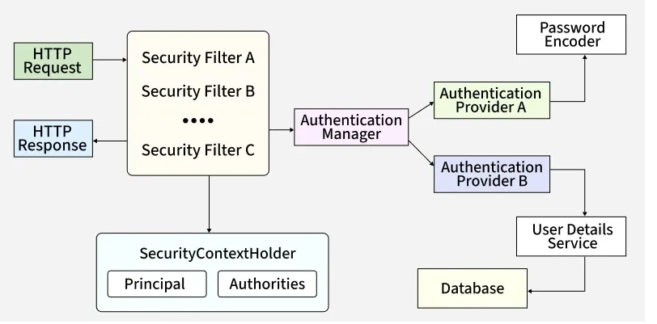
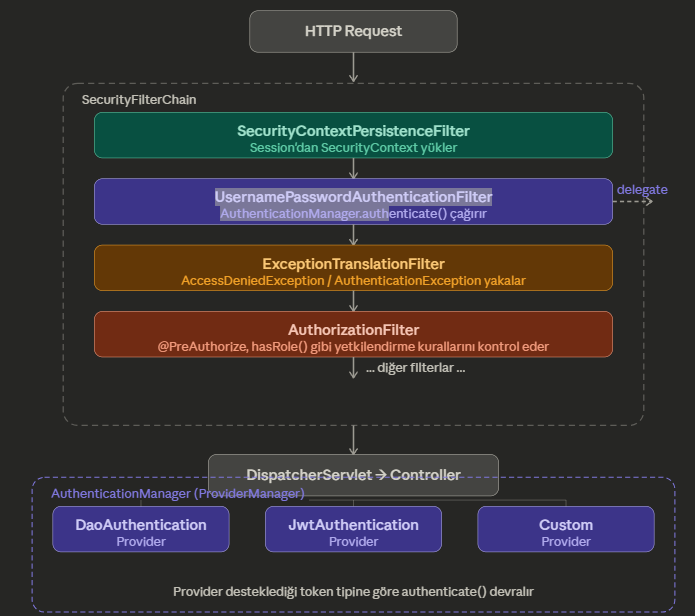
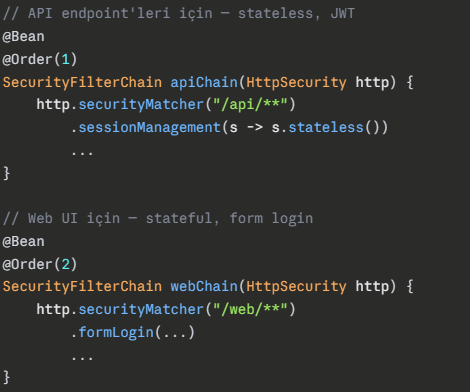
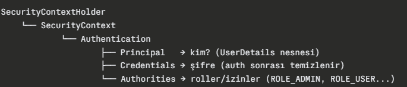
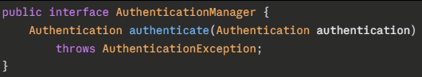
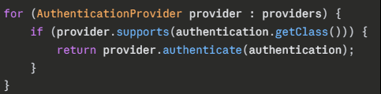
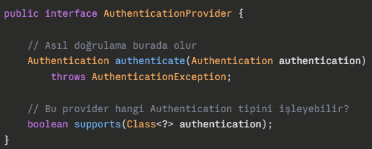

# Spring Security

> Spring Boot, Spring Framework ile uygulama geliştirmenin evrimsel bir aşaması olarak ortaya çıktı.
> Tüm konfigurasyonları kendiniz yazmanız yerine, Spring Boot önceden yazılmış bazı konfigurasyonlarla birlikte gelir,
> böylece yalnızca gerçekleştirmelerinizle uyuşmayan konfigurasyonları override edebilirsiniz.
> Bu yaklaşıma ayrıca **"convention-over-configuration"** da diyoruz. Bundan öncesinde boilerplate konfigurasyonların tekrar tekrar yazılması gerekiyordu.
> Bu konfigürasyonların bolca tekrar yazıldığı dönemlerde monolithic mimarilerde daha az görülürdü çünkü sadece 1 kez yazıyorduk tek bir konfigürasyonu.
> Yani Monolitik mimaride bu pek sorun değildi.
> Ancak Service-oriented yazılım mimarileri geliştikçe, her servisi konfigure etmek için yazmamız gereken tekrarlayan kodların acısını hissetmeye başladık.
> Bunu da yukarıda bahsettiğimiz Spring Boot'un predefined konfigürasyonları çözmeye başladı.

---

## Basic Authentication

Maven veya Gradle projemize aşağıdaki bağımlılıkları eklediğimizde Basic Auth otomatik olarak initialize edilir.

```groovy
implementation("org.springframework.boot:spring-boot-starter-security")
implementation("org.springframework.boot:spring-boot-starter-web")
```

Bunu yaptığınızda, uygulamanız otomatik olarak şifre üretir ve bunu konsola yazdırır.
HTTP Basic authentication ile endpointlerden herhangi birini çağırmak için bu şifreyi kullanmalısınız.

---

## Spring Security Architecture

Spring Boot mimarisinde Security uygularken authentication ve authorization sürecinde rol alan ana aktörleri bilmemiz gereklidir.
Çünkü uygulamanızın ihtiyaçlarına uyacak şekilde önceden konfigure edilmiş bu componentleri override etmeniz gerekecek.
Projenizde security bağımlılıklarını ekleyip hiçbir konfigürasyon eklemediğinizde — yani Basic Auth yaptığınızda — bu componentlerin önceden konfigure edilmiş bir gerçekleştirmesi vardır.

İşte bu componentlerin genel tablosu:



---

### Filter

Bir Security Filter, HTTP request/response döngüsüne araya girerek belirli bir güvenlik sorumluluğunu yerine getiren,
zincirdeki bir sonraki halkaya geçip geçmeyeceğine karar veren bağımsız bir componenttir.

- Her filter tek bir şeyle ilgilenir. CSRF filtresi sadece CSRF'e bakar, CORS filtresi sadece CORS'a. **Single Responsibility** burada çok belirgin.
- Bu Filter'lar birbirinden bağımsız ama sıraya bağımlı. Yani her biri kendi işini tek başına yapar ama zincirdeki sıraları önemli.
- Filter, request'in header, body, cookie, param gibi özniteliklerini okuyabilir; bu kararlar request veya response'u değiştirebilir.
- Her bir Filter'da `AuthenticationManager.authenticate()` çağrılabilir, dolayısıyla arka arkaya `authenticate()` çağrılabilir.
- Bunları da `AuthenticationManager` handle eder ve ilgili provider'a iletir.
- Tüm filter'lar geçilince request'imiz `DispatcherServlet`'e ulaşır ve controller çalışır.

> 💡 Güvenlik görevlisi gibi düşünebilirsin — giriş yaparken üzerini kontrol edip, güvenlik kartının üzerine datalar yazar.



---

### Filter Chain

Filter tanımında belirtilen Filter'ların bağımsız ancak sıraya bağımlı olmasında kastettiğimiz sırayı oluşturan yapıdır.
Her filter işini yapıp `chain.doFilter()` ile bir sonrakine devreder. Sıra bozulursa güvenlik açığı çıkabilir; örneğin authentication olmadan authorization çalışırsa kimin ne yapabileceğini bilemezsin.
Ancak birden fazla Filter Chain olabilir; her chain farklı bir URL pattern'ına karşılık gelir.

> 💡 Bir yolu kapatan 7 farklı kapı olduğunu düşün ve her kapı için bir güvenlik görevlisi olsun. Bu 7 kapının tümü filter chain'dir.
> Bu örüntü defalarca gerçekleşebilir yol boyunca — bu da birden fazla Filter Chain olabilirliğini gösterir.



Birden fazla chain varsa hangi chain'in önce deneneceğini `@Order` belirler. Request ilk uyan chain'e girer, oradan çıkmaz, diğer chain'lere geçmez.

---

### Security Context Holder

Context Holder, başarılı authentication sonrasında *"bu request kim tarafından yapılıyor?"* bilgisini tutan yapıdır.
Yani kısaca Authentication datalarını saklar ve bu bilgiyi **thread-local** olarak tutar. Yani her thread kendi güvenlik bilgisini taşır, başka thread'lerin bilgisiyle karışmaz.
`SecurityContextHolder` thread-local tuttuğu için request tamamlanınca o thread'in context'i temizlenir. Bir sonraki request için temiz sayfa açılır.
Bu temizleme işini `SecurityContextPersistenceFilter` yapar.

> 💡 Context Holder'ı güvenlik kartı gibi düşünebilirsin.



> **Not — Stateless JWT Mimarisi:**
> Stateless JWT mimarisinde her request kendi token'ını taşıdığı için `SecurityContext` hiçbir zaman session'a yazılmaz,
> her seferinde sıfırdan doldurulur ve request bitince silinir. `SecurityContextHolder` hâlâ thread-local olarak tutulur, ancak sadece session'a yazılmaz.

**Referanslar:**
- [SecurityContextHolder](https://docs.spring.io/spring-security/reference/api/java/org/springframework/security/core/context/SecurityContextHolder.html)
- [SecurityContext](https://docs.spring.io/spring-security/reference/api/java/org/springframework/security/core/context/SecurityContext.html)
- [Authentication](https://docs.spring.io/spring-security/reference/api/java/org/springframework/security/core/Authentication.html)
- [Principal](https://docs.oracle.com/en/java/javase/17/docs/api/java.base/java/security/Principal.html)

---

### Authentication Manager

Authentication sürecini kime devredeceğini bilen arayüzdür. Kendisi doğrulama yapmaz, doğru provider'ı bulup işi ona yaptırır.



`AuthenticationManager` arayüzünün implementasyonu ise `ProviderManager`'dir.
`ProviderManager` elindeki provider listesini sırayla dolaşır ve her birine sorar:



- `supports()` **true** dönerse o provider devreye girer.
- **false** dönerse bir sonrakine geçer.
- Hiçbiri sahip çıkmazsa `ProviderNotFoundException` fırlatır.

Arkada kaç provider var, hangisi devreye girdi — filter'ın umurunda değil. Bu da **Facade pattern**'in ta kendisi.

**Referanslar:**
- [AuthenticationManager](https://docs.spring.io/spring-security/reference/api/java/org/springframework/security/authentication/AuthenticationManager.html)
- [ProviderManager](https://docs.spring.io/spring-security/reference/api/java/org/springframework/security/authentication/ProviderManager.html)

---

### Authentication Provider *(OAuth2 / LDAP / JWT)*

Asıl doğrulama işini yapan bileşendir. `AuthenticationManager` *"kime soracağını"* biliyordu, `AuthenticationProvider` ise *"nasıl doğrulayacağını"* biliyor.



> **DaoAuthenticationProvider** — Spring Security'nin varsayılan authentication provider implementasyonu:
> - `UsernamePasswordAuthenticationToken` alır
> - `UserDetailsService` ile DB'den kullanıcıyı çeker
> - `PasswordEncoder` ile şifreyi doğrular
> - Başarılıysa dolu bir `Authentication` nesnesi döner

Spring Security'nin varsayılan authentication provider implementasyonu yerine custom provider yazarken `PasswordEncoder` ve `UserDetailsService` kullanmak zorunda değilsin.
JWT provider ile doğruluyorsan DB'ye hiç gitme ihtiyacın olmayabilir; API key doğruluyorsan sadece key'i kontrol edersin.
Eğer custom provider'ında yine de DB'den kullanıcı çekmek istiyorsan `UserDetailsService`'i inject edip kullanabilirsin. Zorunluluk değil, tercih.

---

### User Details Service

DB'den (veya herhangi bir kaynaktan) kullanıcıyı yüklemekten sorumlu arayüzdür.

---

### Password Encoder

Raw şifreyi hash'lenmiş şifreyle karşılaştırmaktan sorumlu arayüzdür.
